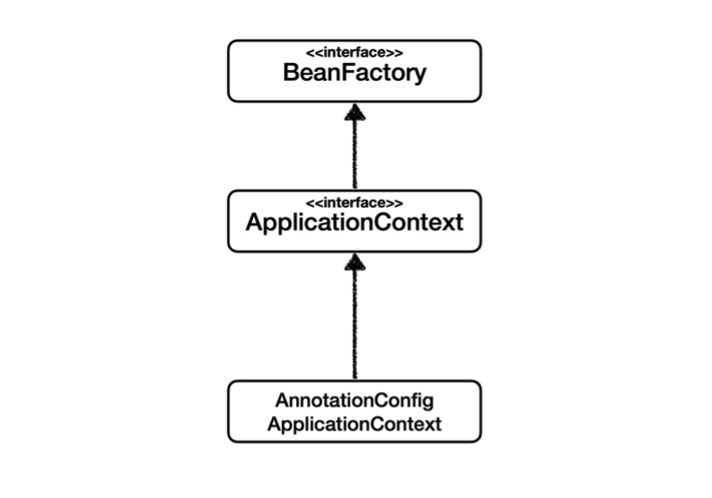
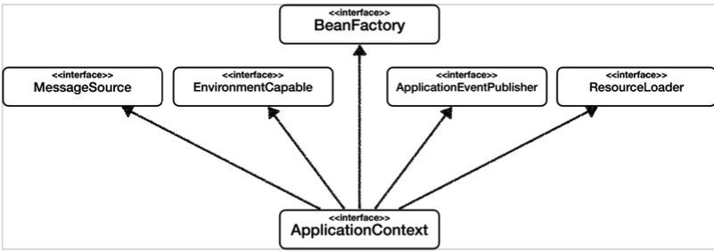
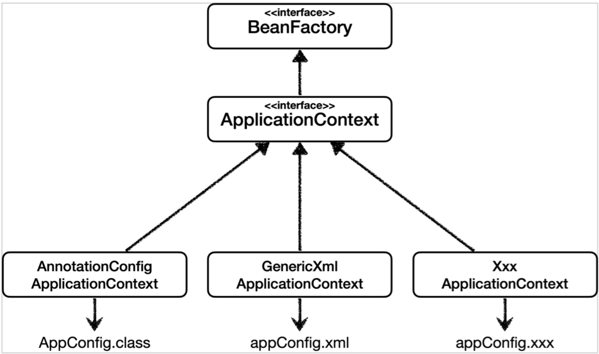
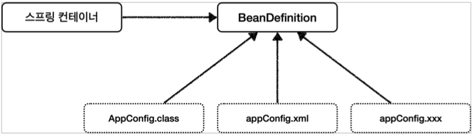
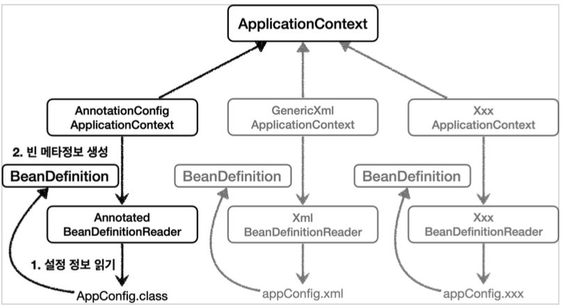
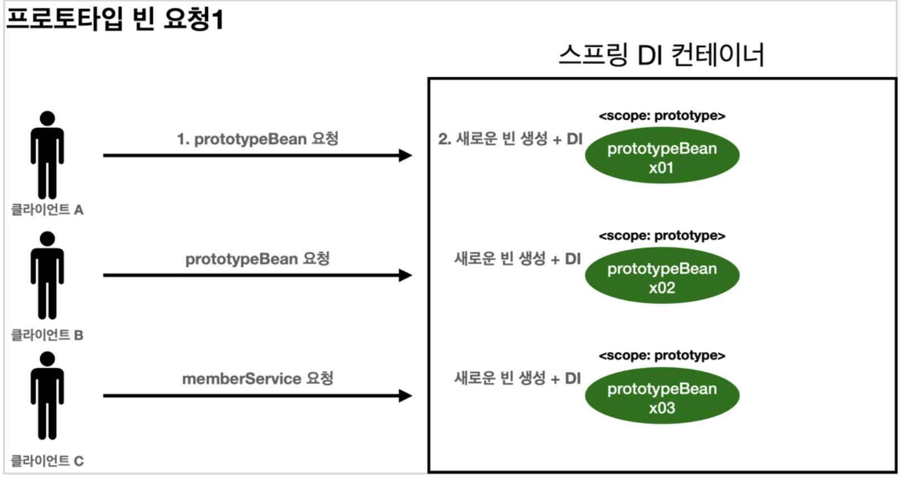
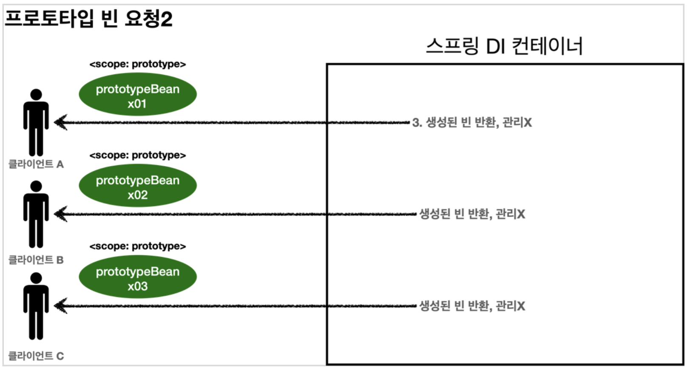

# 스프링 빈
## 빈
**빈 이름**
- 빈이름은 메서드 이름을 사용한다.
- 빈 이름을 직접 부여할 수 도 있다.(비권장)
  - `@Bean(name = "memberService2")`
- 빈 이름은 항상 다른 이름을 부여해야 한다. 같은 이름을 부여하면, 다른 빈이 무시되거나, 기존 빈을 덮어버리거나 설정에 따라 오류가 발생한다.


---
# 스프링 컨테이너
`ApplicationContext`를 스프링 컨테이너라 한다.

```java
@Configuration
public class AppConfig {

  @Bean
  public MemberRepository memberRepository() {
    return new MemoryMemberRepository();
  }

  @Bean
  public MemberService memberService() {
    return new MemberServiceImpl(memberRepository());
  }

  @Bean
  public OrderService orderService() {
    return new OrderServiceImpl(memberRepository(), discountPolicy());
  }

  @Bean
  public DiscountPolicy discountPolicy() {
//    return new FixDiscountPolicy();
    return new RateDiscountPolicy();
  }
}
```
- 기존에는 개발자가 `AppConfig` 를 사용해서 직접 객체를 생성하고 DI를 했지만, 이제부터는 스프링 컨테이너를 통해서 사용한다.
- 스프링 컨테이너는 `@Configuration` 이 붙은 `AppConfig` 를 설정(구성) 정보로 사용한다.
  여기서 `@Bean` 이라 적힌 메서드를 모두 호출해서 반환된 객체를 스프링 컨테이너에 등록한다. 이렇게 **스프링 컨테이너에 등록된 객체를 스프링 빈**이라 한다.
- 스프링 빈은 `@Bean` 이 붙은 메서드의 명을 스프링 빈의 이름으로 사용한다. ( memberService , orderService )
- 이전에는 개발자가 필요한 객체를 `AppConfig` 를 사용해서 직접 조회했지만, 이제부터는 스프링 컨테이너를 통해서 필요한 스프링 빈(객체)를 찾아야 한다. 스프링 빈은 `applicationContext.getBean()` 메서드를 사용해서 찾을 수 있다.
- 기존에는 개발자가 직접 자바코드로 모든 것을 했다면 이제부터는 스프링 컨테이너에 객체를 스프링 빈으로 등록하고, 스프링 컨테이너에서 스프링 빈을 찾아서 사용하도록 변경되었다.
- 스프링 컨테이너는 설정 정보를 참고해서 컨테이너 생성시 의존관계를 주입(DI)한다.

## 스프링 컨테이너 생성

```java
ApplicationContext ac = new AnnotationConfigApplicationContext(AppConfig.class);
```

- `ApplicationContext` 를 스프링 컨테이너라 한다.
- `ApplicationContext` 는 인터페이스이다.
- 스프링 컨테이너는 XML 을 기반으로 만들 수 있고, 애노테이션 기반의 자바 설정 클래스로 만들 수 있다.
- 직전에 `AppConfig` 를 사용했던 방식이 애노테이션 기반의 자바 설정 클래스로 스프링 컨테이너를 만든것이다.
- 자바 설정 클래스를 기반으로 스프링 컨테이너( `ApplicationContext` )를 만들어보자.
    - `new AnnotationConfigApplicationContext(AppConfig.class);`
    - 이 클래스는 `ApplicationContext` 인터페이스의 구현체이다.
- `AppConfig`또한 스프링 빈으로 등록된다.

## 컨테이너에 등록된 모든 빈 조회

```java
AnnotationConfigApplicationContext ac = 
  new AnnotationConfigApplicationContext(AppConfig.class)

// 모든 자바 빈 출력
String[] beanDefinitionNames = ac.getBeanDefinitionNames();
for (String beanDefinitionName : beanDefinitionNames) {
  Object bean = ac.getBean(beanDefinitionName);
  System.out.println("beanDefinitionName = " + beanDefinitionName + " object = " + bean);
}

// Application Bean 출력
String[] beanDefinitionNames = ac.getBeanDefinitionNames();
for (String beanDefinitionName : beanDefinitionNames) {
  BeanDefinition beanDefinition = ac.getBeanDefinition(beanDefinitionName);

  if (beanDefinition.getRole() == BeanDefinition.ROLE_APPLICATION) {
    Object bean = ac.getBean(beanDefinitionName);
    System.out.println("beanDefinitionName = " + beanDefinitionName + " object = " + bean);
  }
}
```
- 모든 빈 출력하기
  - 실행하면 스프링에 등록된 모든 빈 정보를 출력할 수 있다. 
  - `ac.getBeanDefinitionNames()` : 스프링에 등록된 모든 빈 이름을 조회한다.
  - `ac.getBean()` : 빈 이름으로 빈 객체(인스턴스)를 조회한다. 
- 애플리케이션 빈 출력하기 
  - 스프링이 내부에서 사용하는 빈은 getRole() 로 구분할 수 있다. 
  - `ROLE_APPLICATION` : 일반적으로 사용자가 정의한 빈 
  - `ROLE_INFRASTRUCTURE` : 스프링이 내부에서 사용하는 빈

## 스프링 빈 조회 - 기본
스프링 컨테이너에서 스프링 빈을 찾는 가장 기본적인 조회 방법
- `ac.getBean(빈이름, 타입)` 
- `ac.getBean(타입)`
조회 대상 스프링 빈이 없으면 예외 발생 
- `NoSuchBeanDefinitionException: No bean named 'xxxxx' available`
```java
// 이름으로 조회
MemberService memberService = ac.getBean("memberService", MemberService.class);

// 타입으로 조회
MemberService memberService = ac.getBean(MemberService.class);

// 구체타입으로 조회
MemberService memberService = ac.getBean("memberService", MemberServiceImpl.class);

// 없을시 예외 발생
assertThatThrownBy(() -> ac.getBean("xxx", MemberService.class))
    .isInstanceOf(NoSuchBeanDefinitionException.class);
```
구체 타입으로 조회하는건 추천하지 않는다. 역할과 구현을 분리하자 !!

## 스프링 빈 조회 - 동일한 타입이 둘 이상
- 타입으로 조회시 같은 타입의 스프링 빈이 둘 이상이면 오류가 발생한다. 이때는 빈 이름을 지정하자. 
- `ac.getBeansOfType()` 을 사용하면 해당 타입의 모든 빈을 조회할 수 있다.
```java
// 타입으로 조회시 같은 타입이 둘 이상 있으면, 중복 오류가 발생한다
assertThatThrownBy(() -> ac.getBean(MemberRepository.class))
    .isInstanceOf(NoUniqueBeanDefinitionException.class);

// 타입으로 조회시 같은 타입이 둘 이상 있으면 빈 이름을 지정하면 된다.
MemberRepository memberRepository = ac.getBean("memberRepository1", MemberRepository.class);

// 특정 타입을 모두 조회하기
Map<String, MemberRepository> beansOfType = ac.getBeansOfType(MemberRepository.class);
for (String key : beansOfType.keySet()) {
  System.out.println("key = " + key + " value = " + beansOfType.get(key));
}
```
## 스프링 빈 조회 - 상속 관계
- 부모 타입으로 조회하면, 자식 타입도 함께 조회한다.
- 그래서 모든 자바 객체의 최고 부모인 Object 타입으로 조회하면, 모든 스프링 빈을 조회한다.
```java
// 부모 타입으로 조회시, 자식이 둘 이상 있으면 중복 오류가 발생한다.
assertThatThrownBy(() -> ac.getBean(DiscountPolicy.class)).isInstanceOf(
    NoUniqueBeanDefinitionException.class);

// 부모 타입으로 조회시, 자식이 둘 이상 있으면 빈 이름을 지정하면 된다.
DiscountPolicy rateDiscountPolicy = ac.getBean("rateDiscountPolicy", DiscountPolicy.class);

// 특정 하위 타입으로 조회
RateDiscountPolicy rateDiscountPolicy = ac.getBean(RateDiscountPolicy.class);

// 부모타입으로 모두 조회
Map<String, DiscountPolicy> beansOfType = ac.getBeansOfType(DiscountPolicy.class);
assertThat(beansOfType.size()).isEqualTo(2);
for (String key : beansOfType.keySet()) {
  System.out.println("key = " + key + " value = " + beansOfType.get(key));
}
```

## BeanFactory와 ApplicationContext

```text
BeanFactory <- ApplicationContext <- AnnotationConfigApplicationContext
```
### BeanFactory
- 스프링 컨테이너의 최상위 인터페이스다.
- 스프링 빈을 관리하고 조회하는 역할을 담당한다.
- `getBean()` 을 제공한다.
- 지금까지 우리가 사용했던 대부분의 기능은 `BeanFactory`가 제공하는 기능이다.

### ApplicationContext
- `BeanFactory` 기능을 모두 상속받아서 제공한다.



**메시지소스를 활용한 국제화 기능**
  - 예를 들어서 한국에서 들어오면 한국어로, 영어권에서 들어오면 영어로 출력 
**환경변수**
- 로컬, 개발, 운영등을 구분해서 처리 
**애플리케이션 이벤트**
- 이벤트를 발행하고 구독하는 모델을 편리하게 지원
**편리한 리소스 조회**
- 파일, 클래스패스, 외부 등에서 리소스를 편리하게 조회

## 다양한 설정 형식 지원 - 자바 코드, XML
스프링 컨테이너는 다양한 형식의 설정 정보를 받아드릴 수 있게 유연하게 설계되어 있다.
- 자바 코드, XML, Groovy 등등


### 애노테이션 기반 자바 코드 설정 사용
- `new AnnotationConfigApplicationContext(AppConfig.class)` 
- `AnnotationConfigApplicationContext` 클래스를 사용하면서 자바 코드로된 설정 정보를 넘기면 된다.

### XML 설정 사용
- 최근에는 스프링 부트를 많이 사용하면서 XML기반의 설정은 잘 사용하지 않는다. 아직 많은 레거시
프로젝트 들이 XML로 되어 있고, 또 XML을 사용하면 컴파일 없이 빈 설정 정보를 변경할 수 있는 장점도 있다.
- `GenericXmlApplicationContext` 를 사용하면서 xml 설정 파일을 넘기면 된다.

```java
GenericXmlApplicationContext ac = 
        new GenericXmlApplicationContext("appConfig.xml");
```

```xml
<!-- src/main/resources/appConfig.xml-->
<?xml version="1.0" encoding="UTF-8"?>
<beans xmlns="http://www.springframework.org/schema/beans"
  xmlns:xsi="http://www.w3.org/2001/XMLSchema-instance"
  xsi:schemaLocation="http://www.springframework.org/schema/beans http://www.springframework.org/schema/beans/spring-beans.xsd">

  <bean id="memberService" class="jp.falsystack.core.member.MemberServiceImpl">
    <constructor-arg ref="memberRepository" name="memberRepository"/>
  </bean>

  <bean id="memberRepository" class="jp.falsystack.core.member.MemoryMemberRepository" />

  <bean id="discountPolicy" class="jp.falsystack.core.discount.RateDiscountPolicy" />

  <bean id="orderService" class="jp.falsystack.core.order.OrderServiceImpl">
    <constructor-arg ref="discountPolicy" name="discountPolicy" />
    <constructor-arg ref="memberRepository" name="memberRepository" />
  </bean>

</beans>
```

## 스프링 빈 설정 메타 정보 - BeanDefinition
- `BeanDefinition` 을 빈 설정 메타정보라 한다.
  - `@Bean` , `<bean>` 당 각각 하나씩 메타 정보가 생성된다.
- 스프링 컨테이너는 이 메타정보를 기반으로 스프링 빈을 생성한다.





- `AnnotationConfigApplicationContext` 는 `AnnotatedBeanDefinitionReader` 를 사용해서 `AppConfig.class` 를 읽고 `BeanDefinition` 을 생성한다.
- `GenericXmlApplicationContext` 는 `XmlBeanDefinitionReader` 를 사용해서 `appConfig.xml` 설정 정보를 읽고 `BeanDefinition` 을 생성한다.
- 새로운 형식의 설정 정보가 추가되면, `XxxBeanDefinitionReader`를 만들어서 `BeanDefinition` 을 생성하면 된다.

### BeanDefinition 살펴보기

**BeanDefinition 정보**

- `BeanClassName`: 생성할 빈의 클래스 명(자바 설정 처럼 팩토리 역할의 빈을 사용하면 없음) 
- `factoryBeanName`: 팩토리 역할의 빈을 사용할 경우 이름, 예) `appConfig` 
- `factoryMethodName`: 빈을 생성할 팩토리 메서드 지정, 예) `memberService`
- `Scope`: 싱글톤(기본값)
- `lazyInit`: 스프링 컨테이너를 생성할 때 빈을 생성하는 것이 아니라, 실제 빈을 사용할 때 까지 최대한 생성을 지연처리 하는지 여부 
- `InitMethodName`: 빈을 생성하고, 의존관계를 적용한 뒤에 호출되는 초기화 메서드 명 
- `DestroyMethodName`: 빈의 생명주기가 끝나서 제거하기 직전에 호출되는 메서드 명 
- `Constructor arguments`, `Properties`: 의존관계 주입에서 사용한다. (자바 설정 처럼 팩토리 역할의 빈을 사용하면 없음)

```java
String[] beanDefinitionNames = ac.getBeanDefinitionNames();
for (String name : beanDefinitionNames) {
  BeanDefinition beanDefinition = ac.getBeanDefinition(name);
  if (beanDefinition.getRole() == BeanDefinition.ROLE_APPLICATION) {
    System.out.println("name = " + name + " beanDefinition = " + beanDefinition);
  }
}
```
**정리**
- BeanDefinition을 직접 생성해서 스프링 컨테이너에 등록할 수 도 있다. 하지만 실무에서 BeanDefinition을 직접 정의하거나 사용할 일은 거의 없다.
- BeanDefinition에 대해서는 너무 깊이있게 이해하기 보다는, 스프링이 다양한 형태의 설정 정보를 BeanDefinition으로 추상화해서 사용하는 것 정도만 이해하면 된다.

# 싱글톤 컨테이너

## 싱글톤 패턴
클래스의 인스턴스가 딱 1개만 생성되는 것을 보장하는 디자인 패턴이다.

## 싱글톤 컨테이너
스프링 컨테이너는 싱글톤 패턴의 문제점을 해결하면서, 객체 인스턴스를 싱글톤(1개만 생성)으로 관리한다.
- 스프링 컨테이너는 싱글턴 패턴을 적용하지 않아도, 객체 인스턴스를 싱글톤으로 관리한다. 
- 스프링 컨테이너는 싱글톤 컨테이너 역할을 한다. 이렇게 싱글톤 객체를 생성하고 관리하는 기능을 싱글톤 레지스트리라 한다. 
- 스프링 컨테이너의 이런 기능 덕분에 싱글턴 패턴의 모든 단점을 해결하면서 객체를 싱글톤으로 유지할 수 있다. 
- 싱글톤 패턴을 위한 지저분한 코드가 들어가지 않아도 된다. 
- DIP, OCP, 테스트, `private` 생성자로 부터 자유롭게 싱글톤을 사용할 수 있다.

## 싱글톤 방식의 주의점
- 싱글톤 패턴이든, 스프링 같은 싱글톤 컨테이너를 사용하든, 객체 인스턴스를 하나만 생성해서 공유하는 싱글톤 방식은 여러 클라이언트가 하나의 같은 객체 인스턴스를 공유하기 때문에 싱글톤 객체는 상태를 유지(stateful)하게 설계하면 안된다.
- 무상태(stateless)로 설계해야 한다!
- 특정 클라이언트에 의존적인 필드가 있으면 안된다.
- 특정 클라이언트가 값을 변경할 수 있는 필드가 있으면 안된다!
- 가급적 읽기만 가능해야 한다.
- 필드 대신에 자바에서 공유되지 않는, 지역변수, 파라미터, `ThreadLocal` 등을 사용해야 한다.
- 스프링 빈의 필드에 공유 값을 설정하면 정말 큰 장애가 발생할 수 있다!!!

# @Configuration 과 싱글톤
설정정보는 프로젝트의 루트(main이 있는곳)에 두는게 가장 좋다.
## @Configuration 과 바이트코드 조작의 마법

- `@Bean만` 사용해도 스프링 빈으로 등록되지만, 싱글톤을 보장하지 않는다.
  - 스프링 설정 정보는 항상 `@Configuration` 을 사용하자.

# 컴포넌트 스캔
- 컴포넌트 스캔을 사용하려면 먼저 `@ComponentScan` 을 설정 정보에 붙여주면 된다.
```java
@Configuration
@ComponentScan(
    excludeFilters = @ComponentScan.Filter(type = FilterType.ANNOTATION, classes = Configuration.class)
)
public class AutoAppConfig { ... }
```
- 컴포넌트 스캔을 사용하면 `@Configuration` 이 붙은 설정 정보도 자동으로 등록된다.
- 컴포넌트 스캔은 이름 그대로 `@Component` 애노테이션이 붙은 클래스를 스캔해서 스프링 빈으로 등록한다. `@Component` 를 붙여주자.


## @ComponentScan
- `@ComponentScan` 은 `@Component` 가 붙은 모든 클래스를 스프링 빈으로 등록한다. 
  - 이때 스프링 빈의 기본 이름은 클래스명을 사용하되 맨 앞글자만 소문자를 사용한다. 
  - 빈 이름 기본 전략: `MemberServiceImpl` 클래스 ->  `memberServiceImpl`
  - 빈 이름 직접 지정: 만약 스프링 빈의 이름을 직접 지정하고 싶으면 `@Component("memberService2")` 이런식으로 이름을 부여하면 된다.

### 탐색위치 지정
```java
@ComponentScan(
    basePackages = "hello.core",
}
```
- `basePackages` : 탐색할 패키지의 시작 위치를 지정한다. 이 패키지를 포함해서 하위 패키지를 모두 탐색한다. 
  - `basePackages = {"hello.core", "hello.service"}` 이렇게 여러 시작 위치를 지정할 수도 있다.
- `basePackageClasses` : 지정한 클래스의 패키지를 탐색 시작 위치로 지정한다. 
- 만약 지정하지 않으면 `@ComponentScan` 이 붙은 설정 정보 클래스의 패키지가 시작 위치가 된다.

### 스캔 대상
컴포넌트 스캔은 `@Component` 뿐만 아니라 다음과 내용도 추가로 대상에 포함한다. 
- `@Component` : 컴포넌트 스캔에서 사용 / 스프링 MVC 컨트롤러로 인식
- `@Controlller` : 스프링 MVC 컨트롤러에서 사용
- `@Service` : 스프링 비즈니스 로직에서 사용 / 사실 @Service 는 특별한 처리를 하지 않는다.
- `@Repository` : 스프링 데이터 접근 계층에서 사용 / 스프링 데이터 접근 계층으로 인식하고, 데이터 계층의 예외를 스프링 예외로 변환해준다.
- `@Configuration` : 스프링 설정 정보에서 사용 / 앞서 보았듯이 스프링 설정 정보로 인식하고, 스프링 빈이 싱글톤을 유지하도록 추가
  처리를 한다.

### FilterType
- `ANNOTATION`: 기본값, 애노테이션을 인식해서 동작한다. 
  - ex) `org.example.SomeAnnotation`
- `ASSIGNABLE_TYPE`: 지정한 타입과 자식 타입을 인식해서 동작한다. 
  - ex) `org.example.SomeClass`
- `ASPECTJ`: `AspectJ` 패턴 사용 
  - ex) org.example..*Service+
- `REGEX`: 정규 표현식 
  - ex) `org\.example\.Default.*`
- `CUSTOM`: TypeFilter 이라는 인터페이스를 구현해서 처리 
  - ex) `org.example.MyTypeFilter`

### 중복
- 컴포넌트 스캔에 의해 자동으로 스프링 빈이 등록되는데, 그 이름이 같은 경우 스프링은 오류를 발생시킨다.
  - `ConflictingBeanDefinitionException` 예외 발생
- 이 경우 수동 빈 등록이 우선권을 가진다. (수동 빈이 자동 빈을 오버라이딩 해버린다.)
- 스프링 부트 사용시 오류 발생
  - Consider renaming one of the beans or enabling overriding by setting
    spring.main.allow-bean-definition-overriding=true 


## @Autowired
- 스프링 컨테이너가 자동으로 해당 스프링 빈을 찾아서 주입
- `@Autowired` 의 기본 동작은 주입할 대상이 없으면 오류가 발생한다. 
  - 주입할 대상이 없어도 동작하게 하려면 `@Autowired(required = false)` 로 지정하면 된다.
- 순수한 자바 테스트 코드에는 당연히 `@Autowired`가 동작하지 않는다. `@SpringBootTest` 처럼 스프링 컨테이너를 테스트에 통합한 경우에만 가능하다.
- `@Autowired` 매칭 정리
  1. 타입 매칭
  2. 타입 매칭의 결과가 2개 이상일 때 필드 명, 파라미터 명으로 빈 이름 매칭

# 다양한 의존관계 주입 방법
의존관계 주입은 크게 4가지 방법이 있다. 
- 생성자 주입
- 수정자 주입(setter 주입)
- 필드 주입
- 일반 메서드 주입

## 생성자 주입
이름 그대로 생성자를 통해서 의존 관계를 주입 받는 방법이다.
- 특징
  - 생성자 호출시점에 딱 1번만 호출되는 것이 보장된다. 
  - 불변, 필수 의존관계에 사용

```java
private final MemberRepository memberRepository;
private final DiscountPolicy discountPolicy;

@Autowired
public OrderServiceImpl(
    MemberRepository memberRepository, @MainDiscountPolicy DiscountPolicy discountPolicy) {
  this.memberRepository = memberRepository;
  this.discountPolicy = discountPolicy;
}
```
생성자가 딱 1개만 있으면 `@Autowired`를 생략해도 자동 주입 된다. 물론 스프링 빈에만 해당한다.

## 수정자 주입
setter라 불리는 필드의 값을 변경하는 수정자 메서드를 통해서 의존관계를 주입하는 방법이다.
- 특징
  - 선택, 변경 가능성이 있는 의존관계에 사용 
  - 자바빈 프로퍼티 규약의 수정자 메서드 방식을 사용하는 방법이다.
```java
private MemberRepository memberRepository;
private DiscountPolicy discountPolicy;

@Autowired
public void setMemberRepository(MemberRepository memberRepository) {
    this.memberRepository = memberRepository;
}
@Autowired
public void setDiscountPolicy(DiscountPolicy discountPolicy) {
    this.discountPolicy = discountPolicy;
}
```

## 필드 주입
이름 그대로 필드에 바로 주입하는 방법이다.
- 특징
  - 코드가 간결해서 많은 개발자들을 유혹하지만 외부에서 변경이 불가능해서 테스트 하기 힘들다는 치명적인 단점이 있다.
  - DI 프레임워크가 없으면 아무것도 할 수 없다.
  - 사용하지 말자!
    - 애플리케이션의 실제 코드와 관계 없는 테스트 코드
    - 스프링 설정을 목적으로 하는 `@Configuration` 같은 곳에서만 특별한 용도로 사용
```java
@Component
public class OrderServiceImpl implements OrderService {
    @Autowired
    private MemberRepository memberRepository;
    @Autowired
    private DiscountPolicy discountPolicy;
}
```

## 옵션 처리
- 주입할 스프링 빈이 없어도 동작해야 할 때가 있다.
- 그런데 `@Autowired` 만 사용하면 `required` 옵션의 기본값이 `true` 로 되어 있어서 자동 주입 대상이 없으면 오류가 발생한다.
- 자동 주입 대상을 옵션으로 처리하는 방법은 다음과 같다.
  - `@Autowired(required=false)` : 자동 주입할 대상이 없으면 수정자 메서드 자체가 호출 안됨 
  - `org.springframework.lang.@Nullable` : 자동 주입할 대상이 없으면 `null`이 입력된다. 
  - `Optional<>` : 자동 주입할 대상이 없으면 `Optional.empty` 가 입력된다.

## 조회 빈이 2개 이상
### @Autowired 필드 명, @Qualifier, @Primary
조회 대상 빈이 2개 이상일 때 해결 방법
- `@Autowired` 필드 명 매칭
- `@Qualifier` -> `@Qualifier`끼리 매칭 -> 빈 이름 매칭 
- `@Primary` 사용

### @Autowired 필드 명 매칭
`@Autowired` 는 타입 매칭을 시도하고, 이때 여러 빈이 있으면 필드 이름, 파라미터 이름으로 빈 이름을 추가 매칭한다.
**기존 코드**
```java
@Autowired
private DiscountPolicy discountPolicy
```
**필드 명을 빈 이름으로 변경**
```java
@Autowired
private DiscountPolicy rateDiscountPolicy
```
필드 명이 `rateDiscountPolicy` 이므로 정상 주입된다.
- 필드 명 매칭은 먼저 타입 매칭을 시도 하고 그 결과에 여러 빈이 있을 때 추가로 동작하는 기능이다.

### @Qualifier 사용
`@Qualifier` 는 추가 구분자를 붙여주는 방법이다. 주입시 추가적인 방법을 제공하는 것이지 빈 이름을 변경하는 것은 아니다.
**빈 등록시 @Qualifier를 붙여 준다.**
```java
@Component
@Qualifier("mainDiscountPolicy")
public class RateDiscountPolicy implements DiscountPolicy {}

@Component
@Qualifier("fixDiscountPolicy")
public class FixDiscountPolicy implements DiscountPolicy {}
```
**주입시에 `@Qualifier`를 붙여주고 등록한 이름을 적어준다.**
```java
@Autowired
public OrderServiceImpl(
    MemberRepository memberRepository,
    @Qualifier("mainDiscountPolicy") DiscountPolicy discountPolicy) {
  this.memberRepository = memberRepository;
  this.discountPolicy = discountPolicy;
}
```

다음과 같이 직접 빈 등록시에도 @Qualifier를 동일하게 사용할 수 있다.
```java
@Bean
@Qualifier("mainDiscountPolicy")
public DiscountPolicy discountPolicy() {
  return new ...
}
```
**`@Qualifier` 정리**
1. @Qualifier끼리 매칭
2. 빈 이름 매칭
3. `NoSuchBeanDefinitionException` 예외 발생

### @Primary 사용
`@Primary` 는 우선순위를 정하는 방법이다. `@Autowired` 시에 여러 빈이 매칭되면 `@Primary` 가 우선권을 가진다.
- 사용자쪽에게는 @Qualifier 같은것을 붙여줄 필요가 없다.
```java
// rateDiscountPolicy 가 우선권을 가지도록 하자.
@Component
@Primary
public class RateDiscountPolicy implements DiscountPolicy {}

@Component
public class FixDiscountPolicy implements DiscountPolicy {}
```

**@Primary, @Qualifier 활용**
코드에서 자주 사용하는 메인 데이터베이스의 커넥션을 획득하는 스프링 빈이 있고, 코드에서 특별한 기능으로 가끔 사용하는 서브 데이터베이스의 커넥션을 획득하는 스프링 빈이 있다고 생각해보자. 
메인 데이터베이스의 커넥션을 획득하는 스프링 빈은 `@Primary` 를 적용해서 조회하는 곳에서 `@Qualifier` 지정 없이 편리하게 조회하고, 
서브 데이터베이스 커넥션 빈을 획득할 때는 `@Qualifier` 를 지정해서 명시적으로 획득 하는 방식으로 사용하면 코드를 깔끔하게 유지할 수 있다. 
물론 이때 메인 데이터베이스의 스프링 빈을 등록할 때 `@Qualifier` 를 지정해주는 것은 상관없다.

## 조회한 빈이 모두 필요할 때, List, Map
의도적으로 정말 해당 타입의 스프링 빈이 다 필요한 경우도 있다.
예를 들어서 할인 서비스를 제공하는데, 클라이언트가 할인의 종류(rate, fix)를 선택할 수 있다
```java
static class DiscountService {

  private final Map<String, DiscountPolicy> policyMap;
  private final List<DiscountPolicy> policies;

  public DiscountService(Map<String, DiscountPolicy> policyMap, List<DiscountPolicy> policies) {
    this.policyMap = policyMap;
    this.policies = policies;
    System.out.println("policyMap = " + policyMap);
    System.out.println("policies = " + policies);
  }

  public int discount(Member member, int price, String discountCode) {
    DiscountPolicy discountPolicy = policyMap.get(discountCode);
    return discountPolicy.discount(member, price);
  }
}
```

# 빈 생명주기 콜백
스프링 빈은 간단하게 다음과 같은 라이프사이클을 가진다. 
```text
객체 생성 -> 의존관계 주입
```
스프링 빈은 객체를 생성하고, 의존관계 주입이 다 끝난 다음에야 필요한 데이터를 사용할 수 있는 준비가 완료된다. 
따라서 초기화 작업은 의존관계 주입이 모두 완료되고 난 다음에 호출해야 한다. 
그런데 개발자가 의존관계 주입이 모두 완료된 시점을 어떻게 알 수 있을까?
스프링은 의존관계 주입이 완료되면 스프링 빈에게 콜백 메서드를 통해서 초기화 시점을 알려주는 다양한 기능을 제공한다. 
또한 스프링은 스프링 컨테이너가 종료되기 직전에 소멸 콜백을 준다. 따라서 안전하게 종료 작업을 진행할 수 있다.

**스프링 빈의 이벤트 라이프사이클**
```text
스프링컨테이너생성 -> 스프링빈생성 -> 의존관계주입 -> 초기화콜백 -> 사용 -> 소멸전콜백 -> 스프링 종료
```
- 초기화 콜백: 빈이 생성되고, 빈의 의존관계 주입이 완료된 후 호출 
- 소멸전 콜백: 빈이 소멸되기 직전에 호출

**객체의 생성과 초기화를 분리하자.**
생성자는 필수 정보(파라미터)를 받고, 메모리를 할당해서 객체를 생성하는 책임을 가진다. 반면에 초기화는 이렇게 생성된 값들을 활용해서 외부 커넥션을 연결하는등 무거운 동작을 수행한다.
따라서 생성자 안에서 무거운 초기화 작업을 함께 하는 것 보다는 객체를 생성하는 부분과 초기화 하는 부분을 명확하게 나누는 것이 유지보수 관점에서 좋다. 
물론 초기화 작업이 내부 값들만 약간 변경하는 정도로 단순한 경우에는 생성자에서 한번에 다 처리하는게 더 나을 수 있다.

스프링은 크게 3가지 방법으로 빈 생명주기 콜백을 지원한다. 
- 인터페이스(`InitializingBean`, `DisposableBean`)
- 설정 정보에 초기화 메서드, 종료 메서드 지정 
- `@PostConstruct`, `@PreDestroy` 애노테이션 지원

## 인터페이스 InitializingBean, DisposableBean
```java
public class NetworkClient implements InitializingBean, DisposableBean {
    private String url;
    public NetworkClient() {
System.out.println("생성자 호출, url = " + url); }
    public void setUrl(String url) {
        this.url = url;
}
//서비스 시작시 호출
public void connect() {
        System.out.println("connect: " + url);
    }
    public void call(String message) {
        System.out.println("call: " + url + " message = " + message);
}
//서비스 종료시 호출
public void disConnect() {
        System.out.println("close + " + url);
    }
    @Override
    public void afterPropertiesSet() throws Exception {
connect();
call("초기화 연결 메시지");
}
    @Override
    public void destroy() throws Exception {
        disConnect();
    }
}
```
- InitializingBean 은 `afterPropertiesSet()` 메서드로 초기화를 지원한다. 
- DisposableBean 은 `destroy()` 메서드로 소멸을 지원한다.

**초기화, 소멸 인터페이스 단점**
- 이 인터페이스는 스프링 전용 인터페이스다. 해당 코드가 스프링 전용 인터페이스에 의존한다. 
- 초기화, 소멸 메서드의 이름을 변경할 수 없다. 
- 내가 코드를 고칠 수 없는 외부 라이브러리에 적용할 수 없다.

## 빈 등록 초기화, 소멸 메서드 지정
설정 정보에 `@Bean(initMethod = "init", destroyMethod = "close")` 처럼 초기화, 소멸 메서드를 지정할 수 있다.
```java
@Configuration
static class LifeCycleConfig {
    @Bean(initMethod = "init", destroyMethod = "close")
    public NetworkClient networkClient() {
        NetworkClient networkClient = new NetworkClient();
        networkClient.setUrl("http://hello-spring.dev");
        return networkClient;
    } 
}
```
**설정 정보 사용 특징**
- 메서드 이름을 자유롭게 줄 수 있다.
- 스프링 빈이 스프링 코드에 의존하지 않는다.
- 코드가 아니라 설정 정보를 사용하기 때문에 코드를 고칠 수 없는 외부 라이브러리에도 초기화, 종료 메서드를 적용할 수 있다.

**종료 메서드 추론**
- `@Bean`의 `destroyMethod` 속성에는 아주 특별한 기능이 있다.
- 라이브러리는 대부분 close , shutdown 이라는 이름의 종료 메서드를 사용한다.
- `@Bean`의 `destroyMethod` 는 기본값이 (inferred) (추론)으로 등록되어 있다.
- 이 추론 기능은 `close` , `shutdown` 라는 이름의 메서드를 자동으로 호출해준다. 이름 그대로 종료 메서드를 추론해서 호출해준다.
- 따라서 직접 스프링 빈으로 등록하면 종료 메서드는 따로 적어주지 않아도 잘 동작한다.
- 추론 기능을 사용하기 싫으면 `destroyMethod=""` 처럼 빈 공백을 지정하면 된다.

## 애노테이션 @PostConstruct, @PreDestroy
```java
public class NetworkClient {

  private String url;

  public NetworkClient() {
    System.out.println("생성자 호출 url = " + url);
    connect();
    call("초기화 연결 메시지");
  }

  public void setUrl(String url) {
    this.url = url;
  }

  // 서비스 시작시 호출
  public void connect() {
    System.out.println("connect: " + url);
  }

  public void call(String message) {
    System.out.println("call: " + url + "message = " + message);
  }

  // 서비스 종료시 호출
  public void disconnect() {
    System.out.println("close: " + url);
  }

  @PostConstruct
  public void init() {
    System.out.println("NetworkClient.init");
    connect();
    call("초기화 연결 메시지");
  }

  @PreDestroy
  public void close() {
    System.out.println("NetworkClient.close");
    disconnect();
  }
}
```

**@PostConstruct, @PreDestroy 애노테이션 특징**
- 최신 스프링에서 가장 권장하는 방법이다.
- 애노테이션 하나만 붙이면 되므로 매우 편리하다.
- 패키지를 잘 보면 `javax.annotation.PostConstruct` 이다. 
  - 스프링에 종속적인 기술이 아니라 JSR-250 라는 자바 표준이다. 따라서 스프링이 아닌 다른 컨테이너에서도 동작한다.
- 컴포넌트 스캔과 잘 어울린다. 
- 유일한 단점은 외부 라이브러리에는 적용하지 못한다는 것이다. 외부 라이브러리를 초기화, 종료 해야 하면 `@Bean`의 기능을 사용하자.
  
**정리**
- `@PostConstruct, @PreDestroy` 애노테이션을 사용하자
- 코드를 고칠 수 없는 외부 라이브러리를 초기화, 종료해야 하면 `@Bean` 의 `initMethod` , `destroyMethod` 를 사용하자.

# 빈 스코프

**스프링은 다음과 같은 다양한 스코프를 지원한다.**
- 싱글톤: 기본 스코프, 스프링 컨테이너의 시작과 종료까지 유지되는 가장 넓은 범위의 스코프이다. 
- 프로토타입: 스프링 컨테이너는 프로토타입 빈의 생성과 의존관계 주입까지만 관여하고 더는 관리하지 않는 매우 짧은 범위의 스코프이다.
- 웹 관련 스코프
  - `request`: 웹 요청이 들어오고 나갈때 까지 유지되는 스코프이다. 
  - `session`: 웹 세션이 생성되고 종료될 때 까지 유지되는 스코프이다. 
  - `application`: 웹의 서블릿 컨텍스트와 같은 범위로 유지되는 스코프이다.
```java
// 자동 등록
@Scope("prototype")
@Component
public class HelloBean {}

// 수동 등록
@Scope("prototype")
@Bean
PrototypeBean HelloBean() {
  return new HelloBean();
}
```

## 프로토타입 스코프
프로토타입 스코프를 스프링 컨테이너에 조회하면 스프링 컨테이너는 항상 새로운 인스턴스를 생성해서 반환한다.
- 스프링 컨테이너는 **프로토타입 빈**을 생성하고, 의존관계 주입, 초기화까지만 처리한다는 것이다. 
- 클라이언트에 빈을 반환하고, 이후 스프링 컨테이너는 생성된 프로토타입 빈을 관리하지 않는다. 
- 프로토타입 빈을 관리할 책임은 프로토타입 빈을 받은 클라이언트에 있다. 그래서 `@PreDestroy` 같은 종료 메서드가 **호출되지 않는다.**




